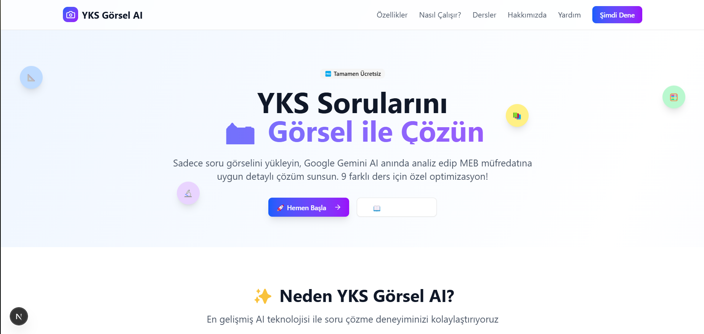

# YKS Görsel Soru Çözüm AI'sı 📸✨

<div align="center">
  
</div>

YKS-AI, üniversite sınavına hazırlanan öğrenciler için geliştirilmiş yapay zeka destekli bir soru çözüm asistanıdır. Soru görsellerini yükleyerek anında detaylı çözüm ve açıklamalar alabilirsiniz. Gemini 1.5 Pro, Claude 3, GPT-4V, Mistral, Cohere ve Ollama gibi güçlü AI modellerini kullanarak, TYT ve AYT sorularını adım adım çözer. MEB müfredatına uygun, ücretsiz ve kullanıcı dostu bir eğitim aracıdır.

**🎯 Nasıl Çalışır?** Sadece soru görselini yükleyin, AI modelleri anında analiz edip MEB müfredatına uygun detaylı çözüm sunsun. 9 farklı ders için özel optimizasyon!

## 🖼️ Özellikler

- **📸 Sadece Görsel**: Metin yazmaya gerek yok, sadece soru görselini yükle
- **🤖 100% Otomatik**: AI görseli okur, analiz eder ve çözer
- **9 Ders Desteği**: Matematik, Fizik, Kimya, Biyoloji, Türkçe, Tarih, Coğrafya, Felsefe, İngilizce
- **🧠 Çoklu AI Desteği**: 
  - **Gemini 1.5 Pro**: Google'ın en güçlü görsel modeli (ücretsiz)
  - **Claude 3**: Anthropic'in en son dil modeli
  - **GPT-4V**: OpenAI'nin görsel destekli modeli
  - **Mistral**: Yüksek performanslı dil modeli
  - **Cohere**: Özelleştirilmiş eğitim asistanı
  - **Ollama**: Yerel AI modelleri desteği
- **💾 Önbellek Sistemi**: Hızlı yanıt için akıllı cache
- **📊 Gelişmiş Analiz**:
  - **Zorluk Seviyesi**: Her soru için zorluk analizi
  - **Benzer Sorular**: Konuyla ilgili benzer soru önerileri
  - **Konu Tekrarı**: Özelleştirilmiş çalışma önerileri
- **MEB Müfredatı Uyumlu**: Her ders için özel analiz
- **Demo Modu**: API key olmadan test edebilme
- **Modern UI**: Drag & drop ile kolay yükleme

## 🚀 Kurulum

1. **Projeyi klonlayın:**
```bash
git clone https://github.com/yourusername/yks-ai.git
cd yks-soru-cozum
```

2. **Bağımlılıkları yükleyin:**
```bash
npm install
```

3. **Environment dosyasını oluşturun:**
```bash
cp .env.local.example .env.local
```

4. **AI API Anahtarlarını Ekleyin (opsiyonel):**
- **Gemini 1.5 Pro (Ücretsiz)**: [Google AI Studio](https://makersuite.google.com/app/apikey)
- **Claude 3**: [Anthropic Console](https://console.anthropic.com/)
- **GPT-4V**: [OpenAI Platform](https://platform.openai.com/)
- **Mistral**: [Mistral Platform](https://console.mistral.ai/)
- **Cohere**: [Cohere Platform](https://dashboard.cohere.ai/)
- **Ollama**: [Ollama Kurulum](https://ollama.ai/)

`.env.local` dosyasına API anahtarlarını ekleyin:
```env
# Gemini 1.5 Pro (Zorunlu)
GOOGLE_API_KEY=your_key_here

# Claude 3 (Opsiyonel)
ANTHROPIC_API_KEY=your_key_here

# OpenAI (Opsiyonel)
OPENAI_API_KEY=your_key_here

# Mistral (Opsiyonel)
MISTRAL_API_KEY=your_key_here

# Cohere (Opsiyonel)
COHERE_API_KEY=your_key_here

# Ollama (Opsiyonel - Yerel Model)
OLLAMA_ENABLED=true
OLLAMA_HOST=http://127.0.0.1:11434

# Cache Ayarları
CACHE_ENABLED=true
```

5. **Geliştirme sunucusunu başlatın:**
```bash
npm run dev
```

## 🆓 Demo Modu

API key olmadan da uygulamayı test edebilirsiniz! Demo modunda:
- Gerçekçi görsel analiz şablonları
- Her ders için özel format
- API key gerektirmez

## 🤖 AI Model Desteği

### Gemini 1.5 Pro (Varsayılan)
- **🆓 Ücretsiz tier** - Aylık 60 istek bedava
- **👁️ Görsel işleme** - Soru görsellerini mükemmel okur
- **🇹🇷 Türkçe desteği** - Türkçe sorularda harika
- **⚡ Hızlı** - Gemini'nin en son modeli
- **🌐 Web Araştırma** - Benzer soruları bulma yeteneği

### Claude 3
- **💪 Güçlü analiz** - Detaylı çözümler
- **📚 Geniş bilgi** - Akademik sorularda başarılı
- **🎯 Doğruluk** - Yüksek doğruluk oranı

### GPT-4V
- **🔍 Görsel anlama** - Karmaşık görselleri analiz eder
- **🧮 Matematiksel** - Formül ve denklemlerde başarılı
- **📊 Grafikler** - Grafik ve şemaları iyi yorumlar

### Mistral
- **🚀 Hızlı işlem** - Düşük latency
- **📝 Detaylı analiz** - Kapsamlı çözümler
- **🎓 Eğitim odaklı** - YKS formatına uygun

### Cohere
- **🎯 Özelleştirilmiş** - Eğitim alanında optimize
- **🔄 Benzer sorular** - Güçlü öneri sistemi
- **📈 Sürekli öğrenme** - Adaptif model

### Ollama
- **🏠 Yerel çalışma** - İnternet bağlantısı gerektirmez
- **🔒 Gizlilik** - Veriler cihazınızda kalır
- **💰 Ücretsiz** - Açık kaynak modeller

## 📱 Kullanım

1. **🎯 Ders Seçin**: 9 farklı dersten birini seçin
2. **🤖 Model Seçin**: Tercih ettiğiniz AI modelini seçin
3. **📸 Görsel Yükleyin**: Soru görselini drag & drop ile yükleyin
4. **⚙️ Özellikler**: İstediğiniz analiz özelliklerini seçin
   - Zorluk seviyesi analizi
   - Benzer soru önerileri
   - Konu tekrarı tavsiyeleri
5. **🚀 Çöz**: "Çöz" butonuna basın
6. **📖 Sonucu İnceleyin**: Detaylı, adım adım çözümü görün

## 🛠️ Teknolojiler

- **Frontend**: Next.js 15, React 19, TypeScript
- **UI**: Shadcn/UI, Tailwind CSS
- **AI**: 
  - Google Gemini 1.5 Pro
  - Anthropic Claude 3
  - OpenAI GPT-4V
  - Mistral AI
  - Cohere
  - Ollama (Yerel)
- **Cache**: Custom MCP Cache System
- **File Upload**: React Dropzone
- **Styling**: Tailwind CSS v4

## 📸 Desteklenen Görsel Türleri

- **PNG, JPG, JPEG** formatları
- **Matematik soruları**: Denklemler, grafikler, geometri
- **Fizik soruları**: Şemalar, devre diyagramları, grafikler
- **Kimya soruları**: Molekül yapıları, reaksiyon denklemleri
- **Diğer dersler**: Metin soruları, şemalar, haritalar

## 🔧 Geliştirme

### Yeni Ders Ekleme
1. `src/app/api/solve-mcp/route.ts` dosyasında `generateSolutionPrompt` fonksiyonuna yeni ders ekleyin
2. `generateDemoSolution` fonksiyonuna demo çözüm ekleyin
3. Frontend'de ders seçeneklerine ekleyin

### Yeni Model Ekleme
1. `src/lib/ai/mcp-service.ts` dosyasında yeni model konfigürasyonu ekleyin
2. Model için özel prompt optimizasyonları ekleyin
3. Frontend'de model seçeneklerine ekleyin

### Prompt Optimizasyonu
- Her ders için özel prompt'lar `generateSolutionPrompt` fonksiyonunda
- Görsel analizi için detaylı talimatlar
- MEB müfredatına uygun format

## 📄 Lisans

MIT License - Detaylar için [LICENSE](LICENSE) dosyasına bakın.

## 🤝 Katkıda Bulunma

1. Fork yapın
2. Feature branch oluşturun (`git checkout -b feature/amazing-feature`)
3. Commit yapın (`git commit -m 'Add amazing feature'`)
4. Push yapın (`git push origin feature/amazing-feature`)
5. Pull Request açın

## 📞 İletişim

- Sorularınız için [issue açın](https://github.com/ogulcan-dev/yks-ai/issues)
- Önerileriniz için [pull request gönderin](https://github.com/ogulcan-dev/yks-ai/pulls)
- Güvenlik bildirimleri için [security.md](SECURITY.md) dosyasına bakın

---

**🎓 Eğitim Amaçlı**: Bu proje YKS'ye hazırlanan öğrencilerin çalışmalarına destek olmak için tasarlanmıştır. Gerçek sınavlarda kullanım kurallarına uygun hareket edin.

**📸 Görsel Güvenlik**: Yüklenen görseller sadece analiz için kullanılır, saklanmaz.

**🔒 Veri Gizliliği**: Tüm işlemler tarayıcınızda gerçekleşir, verileriniz bizimle paylaşılmaz.
